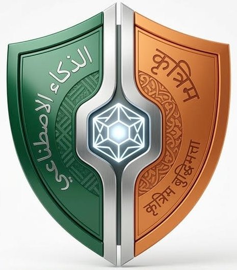

# Avatar Reference

## Final Avatar

### File
- `avatar-final.png` — 465x531px, full color version

### Design Elements

| Element | Description |
|---------|-------------|
| **Shape** | Shield — represents protection and loyalty |
| **Left Side** | Saudi green (#006C35) with Arabic text "محمد" (Mohammed) |
| **Right Side** | Indian saffron (#FF9932) with Hindi text "वसीफ" (Wasif) |
| **Center** | Tech core — circuit/geometric pattern representing AI |
| **Overall** | Tech + Saudi/Indian heritage blend |

### Usage

| Platform | Size | Status |
|----------|------|--------|
| Discord bot | 512x512 | Needs upload |
| OpenClaw | 256x256 | Needs config |
| Favicon | 64x64 | Needs resize |

---

_Last updated: March 17, 2026_
